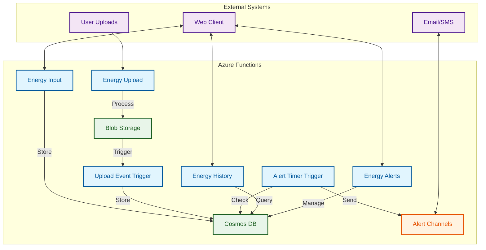

# PGE Energy API

A serverless API built with Azure Functions for managing energy data, alerts, and history. This project provides endpoints for energy data processing, alert management, and 
historical data tracking.

## System Architecture



### Flow Explanation

1. **Data Entry**
   - Users can input energy data directly through the API (`Energy Input`)
   - Or upload files that get processed (`Energy Upload` → `Blob Storage`)

2. **Storage**
   - All energy data lives in `Cosmos DB`
   - Raw uploads hang out in `Blob Storage` first

3. **Processing**
   - Uploads trigger the `Upload Event Trigger` to process and store data
   - `Alert Timer Trigger` checks for threshold breaches
   - Alerts get sent through configured channels (email/SMS)

4. **Querying**
   - `Energy History` handles historical data queries
   - `Energy Alerts` manages alert configurations

5. **External Access**
   - API clients can interact with all services
   - Users can upload data and receive alerts

## What's Inside

- Upload energy data
- Real-time alerts
- Track energy history
- Secure file storage
- Event-driven architecture
- Swagger docs for the API

## Tech Stack

- **Runtime**: Node.js 20.x
- **Framework**: Azure Functions
- **DB**: Azure Cosmos DB
- **Storage**: Azure Blob Storage
- **Events**: Azure Event Grid
- **Docs**: Swagger/OpenAPI

## Features

- Energy data upload and processing
- Real-time energy alerts and notifications
- Historical energy data tracking and analysis
- AI-powered energy efficiency recommendations
- Secure blob storage integration
- Event-driven architecture using Azure Event Grid
- Swagger/OpenAPI documentation

## Database Structure

The application uses Azure Cosmos DB with a doc based model, with the main collection being "energy". The data model is designed around three main document types:

### Document Types

1. **EnergyEntry**
   - Represents individual energy usage records
   - Key fields:
     - `id`: Unique identifier
     - `userId`: Reference to the user who created the entry
     - `entryDate`: Date of the energy reading
     - `usage`: Numeric value of energy usage
     - `createdType`: Source of the entry ("manual" or "upload")
     - `type`: Document type identifier ("energyEntry")

2. **Alert**
   - Manages energy usage alerts and notifications
   - Key fields:
     - `id`: Unique identifier
     - `userId`: Reference to the user who set up the alert
     - `threshold`: Energy usage threshold for triggering alerts
     - `channels`: Notification channels (email, SMS)
     - `type`: Document type identifier ("alert")

3. **User**
   - Stores user information and preferences
   - Key fields:
     - `id`: Unique identifier
     - `username`: Optional username
     - `userRoles`: Optional array of user roles
     - `email`: Optional email address
     - `type`: Document type identifier ("user")

### Design Rationale

- **Type Field**: Each document includes a `type` field to enable efficient querying and filtering of different document types within the same collection
- **Partitioning**: Documents use their `id` as the partition key, providing good distribution across partitions
- **Bulk Operations**: The repository includes optimized bulk insert operations (batch size of 100) for efficient data loading
- **Timestamps**: All documents include `createdAt` and `updatedAt` fields for tracking and auditing
- **Soft Typing**: The system uses TypeScript interfaces to enforce document structure while maintaining flexibility

## Project Structure

```
├── src/                    # Core source code
│   ├── CosmosRepository.ts # Database operations
│   ├── Types.ts           # TypeScript type definitions
│   └── Util.ts            # Utility functions
├── energy_input/          # Energy data input processing
├── energy_upload/         # Energy data upload handling
├── energy_history/        # Historical energy data management
├── energy_alerts/         # Energy alert system
├── recommendations/       # AI-powered energy recommendations
├── alert_timer_trigger/   # Scheduled alert processing
├── upload_event_trigger/  # Event-driven upload processing
├── security_sas/          # Security token generation
└── api_docs/             # API documentation
```

## Prerequisites

- Node.js 20.x or higher
- Azure Functions Core Tools
- Azure subscription (for deployment)

## Installation

1. Clone the repository
2. Install dependencies:
   ```bash
   yarn install
   ```

## Development

- Start the development server:
  ```bash
  yarn start
  ```
- Build the project:
  ```bash
  yarn build
  ```
- Generate API documentation:
  ```bash
  yarn docs
  ```

## API Documentation

The API documentation is available in Swagger/OpenAPI format. You can find the specification in the `api_docs` directory.

## Environment Configuration

Create a `local.settings.json` file with the following structure:

```json
{
  "IsEncrypted": false,
  "Values": {
    "AzureWebJobsStorage": "UseDevelopmentStorage=true",
    "FUNCTIONS_WORKER_RUNTIME": "node",
    "cosmos_db_host": "your-cosmos-db-endpoint",
    "cosmos_auth_key": "your-cosmos-db-key",
    "cosmos_db_id": "your-database-id",
    "blob_storage_account_name": "",
    "blob_storage_account_key": "",
    "blob_storage_container_name": "",
    "AZURE_OPENAI_ENDPOINT": "your-openai-endpoint",
    "AZURE_OPENAI_DEPLOYMENT": "your-deployment-name",
    "AZURE_OPENAI_API_KEY": "your-openai-api-key"
  }
}
```

## API Endpoints

### Recommendations

The recommendations endpoint uses Azure OpenAI to analyze energy consumption patterns and provide personalized energy efficiency recommendations.

**Endpoint:** `GET /api/recommendations/{userId}`

**Response:**
```json
{
  "message": "Recommendations generated successfully",
  "data": {
    "summary": "A brief summary of the consumption patterns",
    "recommendations": ["List of specific recommendations"],
    "estimatedSavings": "Estimated savings in kWh or percentage",
    "entries": 1000
  }
}
```

**Error Responses:**
- 400: User ID is required
- 404: No energy entries found for this user
- 500: Error generating recommendations